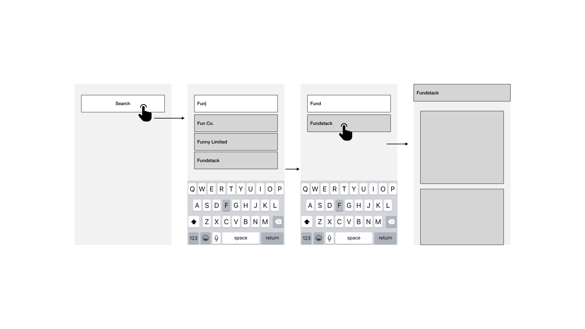

# Fundstack iOS Challenge

Thank you for your interest in joining Fundstack!

As part of our interview process we like to get a feeling for how a developer works and the quality of the end products that they produce. This exercise is designed to give you the opportunity to show how you would design and implement a simple application with functionality similar to that which you would be working on if you joined Fundstack.

In particular we are looking to judge the quality of the core architectural decisions you make, your awareness of the tradeoffs associated with those decisions, and the overall feeling of quality to the resulting application.

## The Challenge

The goal of this challenge is to create a simple company search application using the [Clearbit AutoComplete API](https://clearbit.com/docs#autocomplete-api). This API allows you to submit a search string and find companies that could be a match for that query. 

The application should have two screens - a search page and a detail view. We have provided wireframes below that should guide the layout of the application but the particular styling is up to you. The user should be able to enter a search term into the search page and view a list of the results. **The results should be persisted and cached locally using a mechanism such as CoreData so that repeating a previous query yields instant results**. Clicking on a record should open a detail view with a full screen image of their logo.

## Guidelines

We suggest spending around two hours working on this project although you may spend longer if you wish. We ask that you don't spend more than five hours so we can consider all submissions fairly.

## End Result

The end result should be an XCode project which contains an iOS application written in Swift. 

Good Luck!